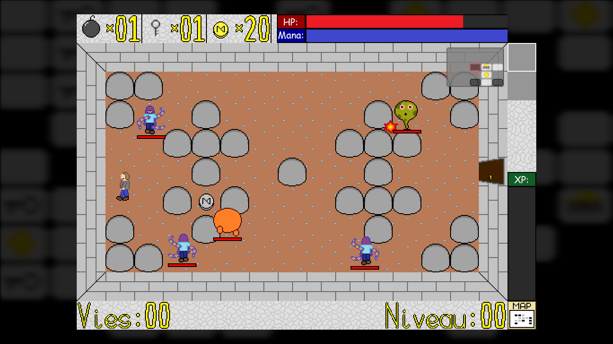

# Endless-Caves - Roguelite 2D développé en Python3 avec Pygame

## Description technique

Ce jeu a été développé en 2014, lors de mon année de première, en utilisant Python 3.2.5 et Pygame.
Vous l'aurez compris à la lecture de la version, ce projet n'est plus du tout mis à jour depuis plusieurs années, mais il est cependant toujours jouable... dépendant de la machine et de l'OS. En tout cas sur ma machine (Ryzen 7 2700X, 1920x1080, Windows 10) le jeu tourne parfaitement.

Si vous voulez le tester vous trouverez un lien de téléchargement vers l'executable compilé en bas de ce README. Si vous voulez le compiler vous-même... et bien bonne chance ! Je peux tout de même vous donner la version des bibliothèques que j'utilisais: Python 3.2.5, Pygame 1.9.2, Cx_Freeze 4.3.1.

## Description du jeu

Il s'agit d'un petit roguelite 2D très (trop) inspiré de *The Binding of Isaac*.
Une partie se déroule en plusieurs niveaux, eux-mêmes composés de salles. Chaque salle est choisie aléatoirement parmi des patternes pseudo-aléatoires prédéfinis (oui c'est bizarre mais c'est dur à expliquer) et peut contenir des objets ou des monstres. Il y a aussi des salles aux trésors (vérouillées ou non) et des salles finales contenant l'echelle vers le niveau suivant.
On tire sur les monstres en cliquant, les clés permettent de déverouiller les salles, les bombes de casser les rochers et les pieces de gagner des vies supplémentaires.
Les objets permettent de gagner des pieces, des clés, des bombes, de l'attaque, de la vitesse d'attaque, de la vitesse, de la vie, de la barre de vie etc.
Le but est d'aller le plus loin possible sachant que à chaque niveau, le niveau devient plus grand, plus dur, les monstres ont plus de vie, tapent plus fort etc.

Une fois une partie finie, vous avez gagné de l'expérience et de l'argent.
L'experience permet de gagner des niveaux qui permettent de débloquer des sorts/compétences (qu'on peut lancer avec un clic droit et choisir avec la molette). L'argent permet d'acheter des pièces d'armures qui augmentent les caractéristiques de départ.

Et pour finir (vos yeux) une petite image du jeu:

Téléchargement de l'executable: [Mediafire](http://www.mediafire.com/file/65ijbhqp7sio8wj/Endless-caves.rar/file)
